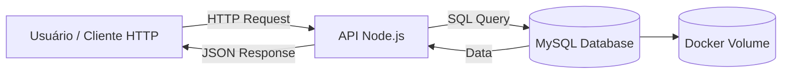
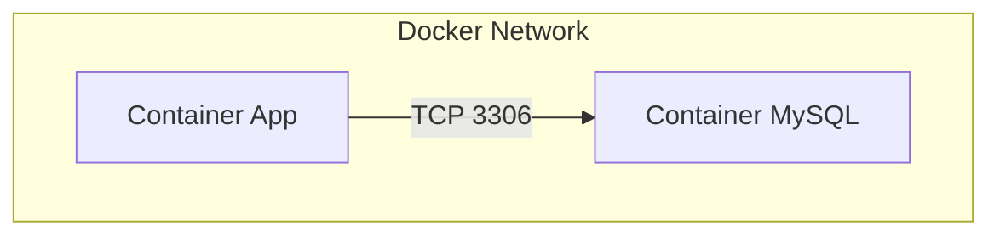
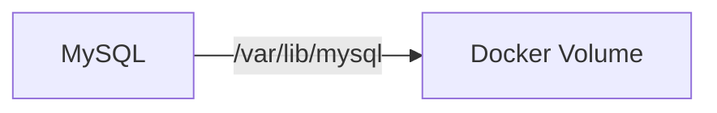
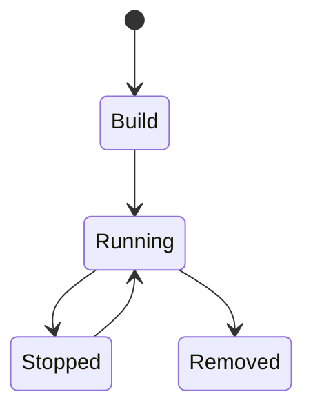

# 🧪 MySQL + Docker Compose + Node.js API Lab

> Laboratório prático para estudo de **banco de dados conteinerizado**, **SQL** e **integração com API**, seguindo boas práticas de arquitetura.

---

## 📌 Visão Geral

Este projeto demonstra como:

* Subir um **MySQL** com Docker Compose
* Garantir **persistência de dados**
* Inicializar o banco automaticamente com SQL
* Integrar com uma **API Node.js**
* Executar operações CRUD via API

---

## 🏗️ Arquitetura

### 📊 Visão de alto nível



---

### 🔗 Comunicação entre containers



---

### 💾 Persistência de dados



---

## 📦 Estrutura do Projeto

```bash id="tree01"
lab-mysql-docker/
├── docker-compose.yml
├── db/
│   └── init.sql
└── app/
    ├── Dockerfile
    ├── package.json
    └── index.js
```

---

## ⚙️ Stack Tecnológica

| Camada         | Tecnologia        |
| -------------- | ----------------- |
| Container      | Docker            |
| Orquestração   | Docker Compose    |
| Banco de Dados | MySQL 8           |
| Backend        | Node.js + Express |
| Driver DB      | mysql2            |

---

## 🚀 Quick Start

### 1. Clonar o projeto

```bash id="clone01"
git clone <repo-url>
cd lab-mysql-docker
```

---

### 2. Subir o ambiente

```bash id="up01"
docker-compose up -d
```

---

### 3. Verificar containers

```bash id="ps01"
docker ps
```

---

### 4. Acessar API

```text id="api01"
http://localhost:3000/usuarios
```

---

## 🧠 Inicialização do Banco

O arquivo `db/init.sql` é executado automaticamente na primeira inicialização do container.

### 📄 Exemplo:

```sql id="sql01"
CREATE TABLE usuarios (
    id INT AUTO_INCREMENT PRIMARY KEY,
    nome VARCHAR(100),
    email VARCHAR(100)
);
```

---

## 🔌 Conexão com Banco

| Parâmetro | Valor   |
| --------- | ------- |
| Host      | mysql   |
| Porta     | 3306    |
| Database  | lab_db  |
| User      | user    |
| Password  | user123 |

---

## 🌐 Endpoints da API

### 📌 GET /usuarios

Retorna todos os usuários:

```json id="json01"
[
  {
    "id": 1,
    "nome": "Ana Silva",
    "email": "ana@email.com"
  }
]
```

---

## 🛡️ CORS (Cross-Origin Resource Sharing)

Para que o frontend consiga consumir a API sem erros de segurança, o CORS deve estar configurado no backend. 

### ⚙️ Configuração Necessária

No arquivo `app/server.js`, certifique-se de que o middleware `cors` está sendo utilizado:

```javascript
const cors = require('cors');

app.use(cors({
  origin: ['http://localhost:8080', 'http://127.0.0.1:8080'], 
  credentials: true 
}));

app.options('*', cors());
```

Isso permite que requisições originadas do frontend (rodando na porta 8080) sejam aceitas pela API.

---

## 🔄 Ciclo de Vida dos Containers



---

## 💾 Persistência

* Utiliza volume Docker:

```yaml id="vol01"
volumes:
  mysql_data:
```

* Dados permanecem mesmo após `docker-compose down`

---

## 🧹 Reset do Ambiente

```bash id="reset01"
docker-compose down -v
```

⚠️ Remove todos os dados

---

## 🧪 Testes Manuais

### Acessar MySQL:

```bash id="mysql01"
docker exec -it mysql_lab mysql -u user -p
```

---

## 🧠 Conceitos Demonstrados

* Containerização de banco de dados
* Rede interna Docker
* Persistência com volumes
* Inicialização automática via script SQL
* Integração backend ↔ banco
* CRUD com SQL

---

## 🔐 Boas Práticas (Sugestões)

* Não usar usuário root em produção
* Externalizar credenciais (env vars / secrets)
* Versionar scripts SQL
* Usar migrations (ex: Flyway, Prisma)

---

## 🧪 Roadmap de Evolução

* [ ] Adicionar endpoint POST /usuarios
* [ ] Implementar validação de dados
* [ ] Adicionar ORM (Sequelize ou Prisma)
* [ ] Criar testes automatizados
* [ ] Integrar com CI/CD
* [ ] Migrar para Kubernetes (StatefulSet)
* [ ] Adicionar observabilidade

---

## 🔧 Ferramentas Recomendadas

* DBeaver
* MySQL Workbench
* VS Code
* Postman / Insomnia

---

## 📚 Referências

* https://docs.docker.com/
* https://hub.docker.com/_/mysql
* https://dev.mysql.com/doc/
* https://expressjs.com/
* https://www.w3schools.com/sql/

---

## 👨‍💻 Contribuição

Contribuições são bem-vindas!

1. Fork do projeto
2. Crie uma branch (`feature/nova-feature`)
3. Commit suas mudanças
4. Push para o repositório
5. Abra um Pull Request

---

## 📄 Licença

Este projeto é destinado a fins educacionais.

---

## 🏁 Conclusão

Este projeto serve como base para evolução em:

* Arquitetura de aplicações
* DevOps (CI/CD)
* Containers e Orquestração
* Integração com cloud

---
