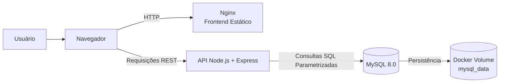
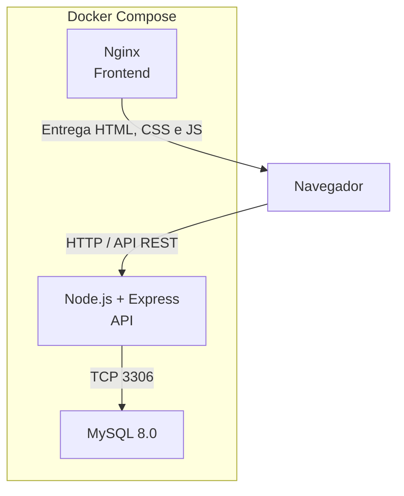
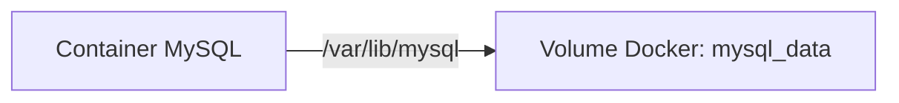
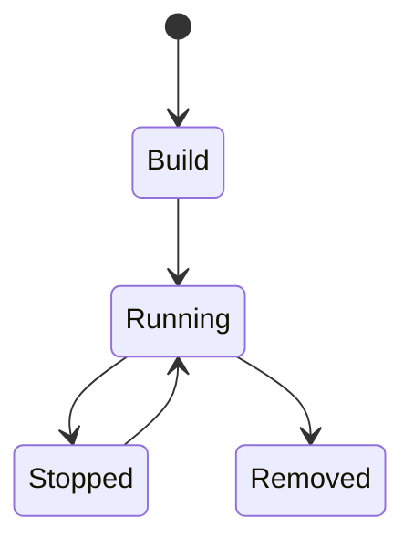

# 📚 Anotebook — Painel Acadêmico com Node.js, MySQL e Docker

> Aplicação web para organização da rotina acadêmica, desenvolvida com **frontend estático**, **API REST em Node.js**, **MySQL**, **Docker Compose** e boas práticas de autenticação, validação e segurança.

---

## 📌 Visão Geral

O **Anotebook** é um painel acadêmico criado para ajudar estudantes a organizar atividades como provas, trabalhos, leituras, projetos, relatórios e demais compromissos com prazo.

A aplicação permite cadastrar, editar, excluir e acompanhar atividades por meio de um dashboard visual, com autenticação por sessão e persistência de dados em banco MySQL.

O projeto foi desenvolvido em ambiente controlado com **VirtualBox**, utilizando containers Docker para separar os serviços de frontend, API e banco de dados.

### Principais funcionalidades

* Tela de login com autenticação por sessão
* Dashboard acadêmico com resumo das atividades
* Cards de contagem para atividades pendentes, em andamento e concluídas
* Cadastro de atividades acadêmicas
* Edição de atividades com preenchimento automático do formulário
* Cancelamento de edição
* Exclusão com confirmação
* Listagem organizada por prazo
* Badges visuais para prioridade e status
* Logout com encerramento da sessão
* Mensagens de sucesso e erro
* Persistência de dados com MySQL e Docker Volume

---

## 🏗️ Arquitetura

### 📊 Visão de alto nível



---

### 🔗 Comunicação entre containers



---

### 💾 Persistência de dados



O volume `mysql_data` mantém as atividades cadastradas mesmo após a reinicialização dos containers.

---

## 📦 Estrutura do Projeto

```bash
anotebook/
├── docker-compose.yml
├── .env.example
├── .gitignore
│
├── app/
│   ├── Dockerfile
│   ├── package.json
│   ├── server.js
│   ├── db.js
│   │
│   ├── routes/
│   │   ├── auth.js
│   │   └── atividades.js
│   │
│   ├── controllers/
│   │   └── atividadesControllers.js
│   │
│   └── services/
│       └── atividadesServices.js
│
├── db/
│   └── init.sql
│
├── frontend/
│   ├── login.html
│   ├── login.css
│   ├── login.js
│   ├── index.html
│   └── app.js
│
└── nginx/
    └── default.conf
```

---

## ⚙️ Stack Tecnológica

| Camada                      | Tecnologia            |
| --------------------------- | --------------------- |
| Ambiente de desenvolvimento | VirtualBox            |
| Containerização             | Docker                |
| Orquestração                | Docker Compose        |
| Frontend                    | HTML, CSS, JavaScript |
| Estilização                 | Tailwind CSS via CDN  |
| Ícones                      | Material Symbols      |
| Servidor web                | Nginx Alpine          |
| Backend                     | Node.js 18 + Express  |
| Banco de dados              | MySQL 8.0             |
| Driver MySQL                | mysql2/promise        |
| Sessão                      | express-session       |
| Segurança HTTP              | Helmet                |
| Controle de requisições     | express-rate-limit    |
| Comunicação entre origens   | CORS                  |

---

## 🚀 Quick Start

### 1. Clonar o repositório

```bash
git clone <URL_DO_SEU_REPOSITORIO>
cd anotebook
```

---

### 2. Criar o arquivo de variáveis de ambiente

Copie o arquivo de exemplo:

```bash
cp .env.example .env
```

Depois, edite o arquivo `.env` e configure as variáveis necessárias.

Exemplo:

```env
DB_HOST=mysql
DB_PORT=3306
DB_NAME=anotebook_db
DB_USER=anotebook_user
DB_PASSWORD=defina_uma_senha_forte

AUTH_USER=usuario_de_teste
AUTH_PASSWORD=defina_uma_senha_forte

SESSION_SECRET=gere_um_segredo_longo_e_aleatorio
```

> ⚠️ O arquivo `.env` contém informações sensíveis e não deve ser enviado ao repositório.

---

### 3. Subir os containers

```bash
docker compose up --build -d
```

Em versões antigas do Docker Compose, utilize:

```bash
docker-compose up --build -d
```

---

### 4. Verificar os containers em execução

```bash
docker compose ps
```

Ou:

```bash
docker ps
```

---

### 5. Acessar a aplicação

Acesse o frontend no navegador pela porta configurada no arquivo `docker-compose.yml`.

Exemplo comum:

```text
http://localhost
```

A API possui uma rota de verificação de saúde:

```text
http://localhost:3000/health
```

> A porta da API pode variar conforme a configuração definida no `docker-compose.yml`.

---

## 🧠 Inicialização do Banco de Dados

O arquivo `db/init.sql` é executado automaticamente na primeira inicialização do container MySQL.

Esse arquivo cria a estrutura inicial do banco e inclui atividades de exemplo para facilitar os testes.

### 📄 Estrutura principal da tabela

```sql
CREATE TABLE atividades (
    id INT AUTO_INCREMENT PRIMARY KEY,
    titulo VARCHAR(120) NOT NULL,
    disciplina VARCHAR(100) NOT NULL,
    categoria VARCHAR(30) NOT NULL,
    prioridade VARCHAR(10) NOT NULL,
    prazo DATE NOT NULL,
    status VARCHAR(20) NOT NULL,
    descricao VARCHAR(500),
    created_at TIMESTAMP DEFAULT CURRENT_TIMESTAMP,
    updated_at TIMESTAMP DEFAULT CURRENT_TIMESTAMP ON UPDATE CURRENT_TIMESTAMP
);
```

---

## 🌐 Endpoints da API

### 📌 Saúde da aplicação

| Método | Rota      | Descrição                    |
| ------ | --------- | ---------------------------- |
| `GET`  | `/health` | Verifica se a API está ativa |

Exemplo de resposta:

```json
{
  "status": "ok"
}
```

---

### 🔐 Autenticação

| Método | Rota           | Descrição                             |
| ------ | -------------- | ------------------------------------- |
| `POST` | `/auth/login`  | Autentica o usuário e cria uma sessão |
| `POST` | `/auth/logout` | Encerra a sessão autenticada          |

#### Exemplo de login

```json
{
  "username": "usuario_de_teste",
  "password": "senha_configurada"
}
```

---

### 📝 Atividades

| Método   | Rota              | Descrição                             |
| -------- | ----------------- | ------------------------------------- |
| `GET`    | `/atividades`     | Lista todas as atividades cadastradas |
| `GET`    | `/atividades/:id` | Busca uma atividade específica        |
| `POST`   | `/atividades`     | Cria uma nova atividade               |
| `PUT`    | `/atividades/:id` | Atualiza uma atividade existente      |
| `DELETE` | `/atividades/:id` | Remove uma atividade                  |

> As rotas relacionadas às atividades exigem uma sessão autenticada.

---

### 📌 Exemplo de cadastro de atividade

```json
{
  "titulo": "Estudar para a prova de Banco de Dados",
  "disciplina": "Banco de Dados",
  "categoria": "Prova",
  "prioridade": "Alta",
  "prazo": "2026-07-15",
  "status": "Pendente",
  "descricao": "Revisar consultas SQL, normalização e transações."
}
```

---

## ✅ Regras de Negócio e Validações

A aplicação valida os dados no frontend e também no backend antes de gravá-los no banco.

### Campos obrigatórios

* Título
* Disciplina
* Categoria
* Prioridade
* Prazo
* Status

### Limites de tamanho

| Campo      |             Limite |
| ---------- | -----------------: |
| Título     | Até 120 caracteres |
| Disciplina | Até 100 caracteres |
| Descrição  | Até 500 caracteres |

### Categorias permitidas

```text
Prova
Trabalho
Leitura
Projeto
Relatório
Outro
```

### Prioridades permitidas

```text
Alta
Média
Baixa
```

### Status permitidos

```text
Pendente
Em andamento
Concluída
```

### Validações de prazo

* O prazo deve seguir o formato ISO: `yyyy-mm-dd`
* Não é permitido cadastrar atividades com data anterior ao dia atual
* As datas são exibidas na interface no formato `dd/mm/yyyy`
* As atividades são ordenadas por prazo crescente
* Em caso de empate no prazo, a ordenação considera o identificador da atividade em ordem decrescente

---

## 🔐 Segurança Aplicada

O Anotebook possui medidas de segurança voltadas para a proteção da sessão, das credenciais, da API e do banco de dados.

### Variáveis de ambiente

* Credenciais do banco e de autenticação são lidas por variáveis de ambiente
* O arquivo `.env.example` documenta as configurações necessárias sem expor dados reais
* O arquivo `.env` deve permanecer fora do versionamento
* A API não inicia caso `SESSION_SECRET` não esteja definido

---

### Sessão e autenticação

* Autenticação baseada em sessão
* Cookie configurado como `HTTP-only`
* `SameSite=Lax` para reduzir riscos relacionados ao envio indevido de cookies entre sites
* Tempo máximo de sessão de duas horas
* Cookie `Secure` habilitado em ambiente de produção
* Regeneração da sessão após login para reduzir risco de **session fixation**
* Logout com encerramento da sessão e redirecionamento para a tela de login

---

### Proteção contra força bruta e abuso

| Controle                      | Configuração                      |
| ----------------------------- | --------------------------------- |
| Rate limit geral              | 300 requisições a cada 15 minutos |
| Rate limit no login           | 5 tentativas a cada 15 minutos    |
| Limite de corpo da requisição | 10 KB                             |

Essas medidas ajudam a reduzir tentativas excessivas de login, abuso de endpoints e envio de payloads muito grandes.

---

### Proteção da API

* `helmet` aplicado para adicionar cabeçalhos HTTP de segurança
* Cabeçalho `x-powered-by` desativado para reduzir exposição desnecessária de tecnologia
* CORS limitado às origens locais autorizadas do frontend
* Requisições autenticadas utilizam `credentials`
* Rotas de atividades protegidas por middleware de autenticação
* Retornos `401 Unauthorized` direcionam o usuário novamente para a tela de login

---

### Proteção contra SQL Injection

As consultas ao MySQL utilizam parâmetros e placeholders por meio do `mysql2/promise`.

Exemplo conceitual:

```js
const [resultado] = await pool.execute(
  'SELECT * FROM atividades WHERE id = ?',
  [id]
);
```

Essa abordagem evita concatenar diretamente dados fornecidos pelo usuário em comandos SQL, reduzindo o risco de ataques de SQL Injection.

---

### Validação e normalização de entradas

Antes de inserir ou atualizar atividades, o backend:

* Verifica os campos obrigatórios
* Limita o tamanho das informações recebidas
* Valida o formato das datas
* Impede prazos vencidos
* Utiliza listas permitidas para categoria, prioridade e status
* Normaliza entradas antes de gravá-las no banco

---

### Cabeçalhos de segurança no Nginx

O Nginx adiciona cabeçalhos básicos de segurança ao frontend:

```nginx
X-Content-Type-Options: nosniff
X-Frame-Options: DENY
Referrer-Policy: strict-origin-when-cross-origin
```

Esses cabeçalhos ajudam a reduzir riscos como:

* Interpretação incorreta de tipos de arquivo
* Clickjacking por carregamento da aplicação em frames externos
* Exposição excessiva de informações de navegação

---

## ♿ Usabilidade e Acessibilidade

O projeto também considera recursos voltados à melhor experiência de uso.

* Layout responsivo para tela de login e dashboard
* Labels associados aos campos dos formulários
* Mensagens de sucesso e erro com `role` e `aria-live`
* Estados de foco visíveis nos campos da tela de login
* Alto contraste entre fundo e textos no dashboard
* Ajustes para placeholders, autofill e cursor
* Badges para identificação rápida de prioridade e status
* Campo de prazo com validação visual do navegador e mensagem personalizada

---

## 🔄 Ciclo de Vida dos Containers



---

## 💾 Persistência de Dados

O banco MySQL utiliza um volume Docker para manter os dados persistentes.

```yaml
volumes:
  mysql_data:
```

Com isso, as atividades permanecem salvas mesmo após comandos como:

```bash
docker compose down
```

---

## 🧹 Reset do Ambiente

Para remover os containers, redes e também os dados persistidos no banco:

```bash
docker compose down -v
```

> ⚠️ Atenção: esse comando remove o volume do MySQL e apaga todas as atividades cadastradas.

---

## 🧪 Testes Manuais

### Verificar os logs da API

```bash
docker compose logs -f app
```

---

### Verificar os logs do MySQL

```bash
docker compose logs -f mysql
```

---

### Acessar o MySQL pelo terminal

```bash
docker compose exec mysql mysql -u <USUARIO_DO_BANCO> -p
```

Depois, selecione o banco:

```sql
USE anotebook_db;
```

E consulte as atividades:

```sql
SELECT * FROM atividades;
```

---

### Testar a rota de saúde

```bash
curl http://localhost:3000/health
```

---

## 🧠 Conceitos Demonstrados

* Desenvolvimento de aplicação web full stack
* Organização acadêmica por meio de CRUD
* API REST com Node.js e Express
* Autenticação baseada em sessão
* Docker e Docker Compose
* Comunicação entre containers
* Persistência de dados com Docker Volumes
* MySQL com inicialização automática por script SQL
* Validação no frontend e backend
* Consultas SQL parametrizadas
* Proteção contra SQL Injection
* Controle de tentativas de login
* Rate limiting
* Uso de variáveis de ambiente
* Cabeçalhos HTTP de segurança
* Acessibilidade básica em interfaces web
* Separação entre frontend, backend, servidor web e banco de dados

---

## 🧪 Roadmap de Evolução

* [ ] Implementar HTTPS em ambiente de produção
* [ ] Armazenar sessões em Redis ou banco de dados
* [ ] Adicionar proteção CSRF para operações autenticadas por cookie
* [ ] Criar testes automatizados para autenticação, validações e CRUD
* [ ] Adicionar migrations versionadas para o banco de dados
* [ ] Criar perfis de acesso para diferentes tipos de usuários
* [ ] Implementar recuperação de senha
* [ ] Adicionar filtros e pesquisa de atividades
* [ ] Criar notificações para prazos próximos
* [ ] Adicionar CI/CD para testes e publicação automatizada
* [ ] Criar painel de observabilidade e monitoramento

---

## 🔧 Ferramentas Recomendadas

* Visual Studio Code
* Docker Desktop ou Docker Engine
* VirtualBox
* Postman ou Insomnia
* DBeaver
* MySQL Workbench
* Git e GitHub

---

## 📚 Referências

* Docker: https://docs.docker.com/
* Docker Compose: https://docs.docker.com/compose/
* MySQL: https://dev.mysql.com/doc/
* Node.js: https://nodejs.org/
* Express: https://expressjs.com/
* Helmet: https://helmetjs.github.io/
* mysql2: https://sidorares.github.io/node-mysql2/
* OWASP: https://owasp.org/
* MDN Web Docs: https://developer.mozilla.org/

---

## 👩‍💻 Autora

**Maria Vitória Teixeira e Silva**

Projeto desenvolvido para fins acadêmicos, com foco em desenvolvimento web, organização de atividades e aplicação de boas práticas de segurança.

---

## 📄 Licença

Este projeto é destinado a fins educacionais.

---

## 🏁 Conclusão

O Anotebook demonstra a construção de uma aplicação web completa para gerenciamento de atividades acadêmicas.

Além das funcionalidades de cadastro, edição, exclusão e acompanhamento de tarefas, o projeto aplica conceitos importantes de desenvolvimento full stack, como autenticação por sessão, integração com API REST, persistência em banco MySQL, Dockerização, validação de dados e segurança de aplicações web.

A arquitetura utilizada permite que o projeto evolua futuramente para ambientes mais robustos, com HTTPS, testes automatizados, armazenamento externo de sessões, CI/CD e monitoramento.
